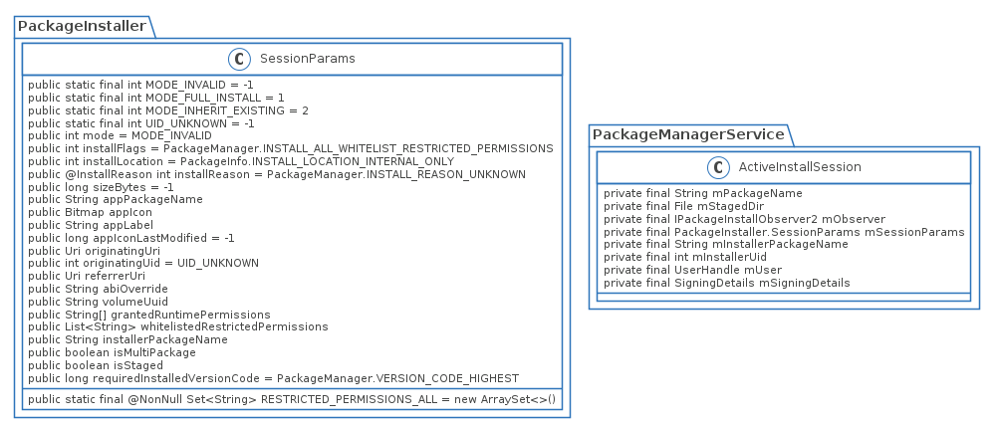

---
title:Android Q PackageInstaller安装Package流程
date:2020/06/10
category:
  - android
  - framework
---

Android Q用的是GooglePackageInstaller,看类和接口方面和AOSP中PackageInstaller应当是类似的代码和流程

# 类图



# InstallInstalling.onCreate()
```java
    @Override
    protected void onCreate(@Nullable Bundle savedInstanceState) {

    /******省略UI初始化的代码******/
        PackageInstaller.SessionParams params = new PackageInstaller.SessionParams(
                PackageInstaller.SessionParams.MODE_FULL_INSTALL);
        params.setInstallAsInstantApp(false);
        params.setReferrerUri(getIntent().getParcelableExtra(Intent.EXTRA_REFERRER));
        params.setOriginatingUri(getIntent()
                .getParcelableExtra(Intent.EXTRA_ORIGINATING_URI));
        params.setOriginatingUid(getIntent().getIntExtra(Intent.EXTRA_ORIGINATING_UID,
                UID_UNKNOWN));
        params.setInstallerPackageName(getIntent().getStringExtra(
                Intent.EXTRA_INSTALLER_PACKAGE_NAME));
        params.setInstallReason(PackageManager.INSTALL_REASON_USER);

        File file = new File(mPackageURI.getPath());
        try {
            PackageParser.PackageLite pkg = PackageParser.parsePackageLite(file, 0);
            params.setAppPackageName(pkg.packageName);
            params.setInstallLocation(pkg.installLocation);
            params.setSize(
                    PackageHelper.calculateInstalledSize(pkg, false, params.abiOverride));
        } catch (PackageParser.PackageParserException e) {
            Log.e(LOG_TAG, "Cannot parse package " + file + ". Assuming defaults.");
            Log.e(LOG_TAG,
                    "Cannot calculate installed size " + file + ". Try only apk size.");
            params.setSize(file.length());
        } catch (IOException e) {
            Log.e(LOG_TAG,
                    "Cannot calculate installed size " + file + ". Try only apk size.");
            params.setSize(file.length());
        }

        try {
            mInstallId = InstallEventReceiver
                    .addObserver(this, EventResultPersister.GENERATE_NEW_ID,
                            this::launchFinishBasedOnResult);
        } catch (EventResultPersister.OutOfIdsException e) {
            launchFailure(PackageManager.INSTALL_FAILED_INTERNAL_ERROR, null);
        }

        try {
            mSessionId = getPackageManager().getPackageInstaller().createSession(params);
        } catch (IOException e) {
            launchFailure(PackageManager.INSTALL_FAILED_INTERNAL_ERROR, null);
        }
    }
```
这部分代码主要是构造`SessionParams`，通过它创建`PackageInstallSession`。`PackageInstallSession`主要是为了多个APK同时安装的情况，包括Split apk的安装。

## PackageInstallerService.createSession()
`getPackageManager().getPackageInstaller().createSession(params)`这个调用最终还是调到`PackageInstallerService.createSession()`
```java
    @Override
    public int createSession(SessionParams params, String installerPackageName, int userId) {
        try {
            return createSessionInternal(params, installerPackageName, userId);
        } catch (IOException e) {
            throw ExceptionUtils.wrap(e);
        }
    }

```
## PackageInstallerService.createSessionInternal()
```java
    private int createSessionInternal(SessionParams params, String installerPackageName, int userId)
            throws IOException {

        /******省略部分处理installFlags代码******/
        if (!params.isMultiPackage){
            /******省略部分无关代码******/
            if ((params.installFlags & PackageManager.INSTALL_INTERNAL) != 0) {
                if (!PackageHelper.fitsOnInternal(mContext, params)) {
                    throw new IOException("No suitable internal storage available");
                }
            } else if ((params.installFlags & PackageManager.INSTALL_FORCE_VOLUME_UUID) != 0) {
                // For now, installs to adopted media are treated as internal from
                // an install flag point-of-view.
                params.installFlags |= PackageManager.INSTALL_INTERNAL;
            } else {
                params.installFlags |= PackageManager.INSTALL_INTERNAL;

                // Resolve best location for install, based on combination of
                // requested install flags, delta size, and manifest settings.
                final long ident = Binder.clearCallingIdentity();
                try {
                    params.volumeUuid = PackageHelper.resolveInstallVolume(mContext, params);
                } finally {
                    Binder.restoreCallingIdentity(ident);
                }
            }
        }

        final int sessionId;
        final PackageInstallerSession session;
        synchronized (mSessions) {
            // Sanity check that installer isn't going crazy
            final int activeCount = getSessionCount(mSessions, callingUid);
            if (activeCount >= MAX_ACTIVE_SESSIONS) {
                throw new IllegalStateException(
                        "Too many active sessions for UID " + callingUid);
            }
            final int historicalCount = mHistoricalSessionsByInstaller.get(callingUid);
            if (historicalCount >= MAX_HISTORICAL_SESSIONS) {
                throw new IllegalStateException(
                        "Too many historical sessions for UID " + callingUid);
            }

            sessionId = allocateSessionIdLocked();
        }

        final long createdMillis = System.currentTimeMillis();
        // We're staging to exactly one location
        File stageDir = null;
        String stageCid = null;
        if (!params.isMultiPackage) {
            if ((params.installFlags & PackageManager.INSTALL_INTERNAL) != 0) {
                stageDir = buildSessionDir(sessionId, params);
            } else {
                stageCid = buildExternalStageCid(sessionId);
            }
        }
        session = new PackageInstallerSession(mInternalCallback, mContext, mPm, this,
                mInstallThread.getLooper(), mStagingManager, sessionId, userId,
                installerPackageName, callingUid, params, createdMillis, stageDir, stageCid, false,
                false, false, null, SessionInfo.INVALID_ID, false, false, false,
                SessionInfo.STAGED_SESSION_NO_ERROR, "");

        synchronized (mSessions) {
            mSessions.put(sessionId, session);
        }
        if (params.isStaged) {
            mStagingManager.createSession(session);
        }

        if ((session.params.installFlags & PackageManager.INSTALL_DRY_RUN) == 0) {
            mCallbacks.notifySessionCreated(session.sessionId, session.userId);
        }
        writeSessionsAsync();
        return sessionId;
    }
```
这块省略了`installFlags`处理的代码，经过处理之后`installFlags`的值应该是:
`INSTALL_ALL_WHITELIST_RESTRICTED_PERMISSIONS | INSTALL_REPLACE_EXISTING | INSTALL_INTERNAL`。`INSTALL_INTERNAL`指的是在手机内部存储中安装APK，
与之对应的是在SDCard中安装APK，通常发生在内部存储不够的情况下,但是这个地方处理很奇怪，因为处理的结果一定是含有`INSTALL_INTERNAL`标志或者是有异常。
创建`PackageInstallSession`的逻辑如下：
1. 检测session的数量是否溢出
2. 创建StageDir,这里不贴代码了,`params.isStaged`为`false`, 所以创建的StageDir为`vmdl+(sessionId).tmp`
3. 创建并存储`PackageInstallerSession`

其实这里有个疑问是为什么要用`writeSessionsAsync()`来持久化存储session，存储在`/data/system/install_sessions.xml`,目前感觉没有必要,不知道还是不是有其他的作用。
`stageDir`的作用是暂时存储同一个`sessionId`中所commit的APK文件(可能是不止一个)，

# InstallInstalling.onResume()
```java
    @Override
    protected void onResume() {
        super.onResume();

        // This is the first onResume in a single life of the activity
        if (mInstallingTask == null) {
            PackageInstaller installer = getPackageManager().getPackageInstaller();
            PackageInstaller.SessionInfo sessionInfo = installer.getSessionInfo(mSessionId);

            if (sessionInfo != null && !sessionInfo.isActive()) {
                mInstallingTask = new InstallingAsyncTask();
                mInstallingTask.execute();
            } else {
                // we will receive a broadcast when the install is finished
                mCancelButton.setEnabled(false);
                setFinishOnTouchOutside(false);
            }
        }
    }
```
`SessionInfo`是由`PackageInstallerSession`的部分属性集合，因为`PackageInstallerSession`是作为一个服务存在的，属性值无法传到`PackageInstaller`。
所以就需要使用`SessionInfo`作为属性集合来进行通信。`PackageInstaller`是`PackageInstallerService`的代理类，`PackageInstaller.Session`则是
`PackageInstallerSession`的代理类

## InstallInstalling.InstallingAsyncTask.doInBackground()
```java
   @Override
   protected PackageInstaller.Session doInBackground(Void... params) {
       PackageInstaller.Session session;
       try {
           session = getPackageManager().getPackageInstaller().openSession(mSessionId);
       } catch (IOException e) {
           return null;
       }

       session.setStagingProgress(0);

       try {
           File file = new File(mPackageURI.getPath());

           try (InputStream in = new FileInputStream(file)) {
               long sizeBytes = file.length();
               try (OutputStream out = session
                       .openWrite("PackageInstaller", 0, sizeBytes)) {
                   byte[] buffer = new byte[1024 * 1024];
                   while (true) {
                       int numRead = in.read(buffer);

                       if (numRead == -1) {
                           session.fsync(out);
                           break;
                       }

                       if (isCancelled()) {
                           session.close();
                           break;
                       }

                       out.write(buffer, 0, numRead);
                       if (sizeBytes > 0) {
                           float fraction = ((float) numRead / (float) sizeBytes);
                           session.addProgress(fraction);
                       }
                   }
               }
           }

           return session;
       } catch (IOException | SecurityException e) {
           Log.e(LOG_TAG, "Could not write package", e);

           session.close();

           return null;
       } finally {
           synchronized (this) {
               isDone = true;
               notifyAll();
           }
       }
   }
```
这里分为两步进行操作：
1. 调用`PackageInstallerService.openSession()`来创建`stageDir`,具体的调用过程:
`PackageInstallerService.openSession()->PackageInstallerSession.open()->PackageInstallerService.prepareStageDir()`
```java
//PackageInstallerService
    static void prepareStageDir(File stageDir) throws IOException {
        if (stageDir.exists()) {
            throw new IOException("Session dir already exists: " + stageDir);
        }

        try {
            Os.mkdir(stageDir.getAbsolutePath(), 0775);
            Os.chmod(stageDir.getAbsolutePath(), 0775);
        } catch (ErrnoException e) {
            // This purposefully throws if directory already exists
            throw new IOException("Failed to prepare session dir: " + stageDir, e);
        }

        if (!SELinux.restorecon(stageDir)) {
            throw new IOException("Failed to restorecon session dir: " + stageDir);
        }
    }
```
2. 将apk文件拷入到`/data/app/stageDir`目录中，涉及到文件拷贝，比较复杂，没有深入的研究。

## InstallInstalling.InstallingAsyncTask.onPostExecute()
```java
    @Override
    protected void onPostExecute(PackageInstaller.Session session) {
        if (session != null) {
            Intent broadcastIntent = new Intent(BROADCAST_ACTION);
            broadcastIntent.setFlags(Intent.FLAG_RECEIVER_FOREGROUND);
            broadcastIntent.setPackage(getPackageName());
            broadcastIntent.putExtra(EventResultPersister.EXTRA_ID, mInstallId);

            PendingIntent pendingIntent = PendingIntent.getBroadcast(
                    InstallInstalling.this,
                    mInstallId,
                    broadcastIntent,
                    PendingIntent.FLAG_UPDATE_CURRENT);

            session.commit(pendingIntent.getIntentSender());
            mCancelButton.setEnabled(false);
            setFinishOnTouchOutside(false);
        } else {
            getPackageManager().getPackageInstaller().abandonSession(mSessionId);

            if (!isCancelled()) {
                launchFailure(PackageManager.INSTALL_FAILED_INVALID_APK, null);
            }
        }
    }
```
这里涉及到了一个`PendingIntent`的概念，是安装完成之后给`PackageInstaller`发送广播, 但是为什么要用广播而不用Callback的方式只有Google工程师才知道了

## PackageInstaller.Session.commit()
```java
    public void commit(@NonNull IntentSender statusReceiver) {
        try {
            mSession.commit(statusReceiver, false);
        } catch (RemoteException e) {
            throw e.rethrowFromSystemServer();
        }
    }
```
上面说过`PackageInstaller.Session`是`PackageInstallerSession`的代理类，最终还是调到`PackageInstallerSession`的`commit()`方法

## PackageInstallerSession.commit()
```java
    @Override
    public void commit(@NonNull IntentSender statusReceiver, boolean forTransfer) {
        if (hasParentSessionId()) {
            throw new IllegalStateException(
                    "Session " + sessionId + " is a child of multi-package session "
                            + mParentSessionId +  " and may not be committed directly.");
        }
        if (!markAsCommitted(statusReceiver, forTransfer)) {
            return;
        }
        /******省略MultiPackage处理******/
        mHandler.obtainMessage(MSG_COMMIT).sendToTarget();
    }
```
这里省略multi package的处理, 因为`PackageInstaller`没有设置multiPackage的标志, `markAsCommitted()`主要验证创建Session和安装Package的uid是否有改变以及处理回调

### PackageInstallerSession.markAsCommitted()
```java
    public boolean markAsCommitted(
            @NonNull IntentSender statusReceiver, boolean forTransfer) {
        Preconditions.checkNotNull(statusReceiver);

        List<PackageInstallerSession> childSessions = getChildSessions();

        final boolean wasSealed;
        synchronized (mLock) {
            assertCallerIsOwnerOrRootLocked();
            assertPreparedAndNotDestroyedLocked("commit");

            final PackageInstallObserverAdapter adapter = new PackageInstallObserverAdapter(
                    mContext, statusReceiver, sessionId,
                    isInstallerDeviceOwnerOrAffiliatedProfileOwnerLocked(), userId);
            mRemoteObserver = adapter.getBinder();

            if (forTransfer) {
                mContext.enforceCallingOrSelfPermission(Manifest.permission.INSTALL_PACKAGES, null);

                if (mInstallerUid == mOriginalInstallerUid) {
                    throw new IllegalArgumentException("Session has not been transferred");
                }
            } else {
                if (mInstallerUid != mOriginalInstallerUid) {
                    throw new IllegalArgumentException("Session has been transferred");
                }
            }

            // After validations and updating the observer, we can skip re-sealing, etc. because we
            // have already marked ourselves as committed.
            if (mCommitted) {
                return true;
            }

            wasSealed = mSealed;
            if (!mSealed) {
                try {
                    sealAndValidateLocked(childSessions);
                } catch (IOException e) {
                    throw new IllegalArgumentException(e);
                } catch (PackageManagerException e) {
                    // Do now throw an exception here to stay compatible with O and older
                    destroyInternal();
                    dispatchSessionFinished(e.error, ExceptionUtils.getCompleteMessage(e), null);
                    return false;
                }
            }

            // Client staging is fully done at this point
            mClientProgress = 1f;
            computeProgressLocked(true);

            // This ongoing commit should keep session active, even though client
            // will probably close their end.
            mActiveCount.incrementAndGet();

            mCommitted = true;
        }

        if (!wasSealed) {
            // Persist the fact that we've sealed ourselves to prevent
            // mutations of any hard links we create. We do this without holding
            // the session lock, since otherwise it's a lock inversion.
            mCallback.onSessionSealedBlocking(this);
        }
        return true;
    }

```
`markAsCommitted()`主要做了三件事
1. 处理statusReceiver，将其和Observer绑定
2. 处理创建session和使用session的应用是否有变化
3. wasSealed的用途暂时没有搞清楚

## PackageInstallerSession.mHandlerCallback.handleMessage()
```java
    private final Handler.Callback mHandlerCallback = new Handler.Callback() {
        @Override
        public boolean handleMessage(Message msg) {
            switch (msg.what) {
                case MSG_COMMIT:
                    handleCommit();
                    break;
            }
            return true;
        }
    }
```
## PackageInstallerSession.handleCommit()
```java
    private void handleCommit() {
        if (isInstallerDeviceOwnerOrAffiliatedProfileOwnerLocked()) {
            DevicePolicyEventLogger
                    .createEvent(DevicePolicyEnums.INSTALL_PACKAGE)
                    .setAdmin(mInstallerPackageName)
                    .write();
        }
        if (params.isStaged) {
            mStagingManager.commitSession(this);
            destroyInternal();
            dispatchSessionFinished(PackageManager.INSTALL_SUCCEEDED, "Session staged", null);
            return;
        }

        if ((params.installFlags & PackageManager.INSTALL_APEX) != 0) {
            destroyInternal();
            dispatchSessionFinished(PackageManager.INSTALL_FAILED_INTERNAL_ERROR,
                    "APEX packages can only be installed using staged sessions.", null);
            return;
        }

        // For a multiPackage session, read the child sessions
        // outside of the lock, because reading the child
        // sessions with the lock held could lead to deadlock
        // (b/123391593).
        List<PackageInstallerSession> childSessions = getChildSessions();

        try {
            synchronized (mLock) {
                commitNonStagedLocked(childSessions);
            }
        } catch (PackageManagerException e) {
            final String completeMsg = ExceptionUtils.getCompleteMessage(e);
            Slog.e(TAG, "Commit of session " + sessionId + " failed: " + completeMsg);
            destroyInternal();
            dispatchSessionFinished(e.error, completeMsg, null);
        }
    }
```
`params.isStaged`为`false`, `childSessions`为`null` 

## PackageInstallerSession.commitNonStagedLocked()
```java
    private void commitNonStagedLocked(List<PackageInstallerSession> childSessions)
            throws PackageManagerException {
        final PackageManagerService.ActiveInstallSession committingSession =
                makeSessionActiveLocked();
        if (committingSession == null) {
            return;
        }
        if (isMultiPackage()) {
            /******忽略multi package的处理******/
        } else {
            mPm.installStage(committingSession);
        }
    }
```
最主要的部分就是`makeSessionActiveLocked()`创建`ActiveInstallSession`， 最后调用`PackageManagerService.installStage()`

### PackageInstallerSession.makeSessionActiveLocked()
```java
    private PackageManagerService.ActiveInstallSession makeSessionActiveLocked()
            throws PackageManagerException {
        //1. Check permissions and conditions
        if (mRelinquished) {
            throw new PackageManagerException(INSTALL_FAILED_INTERNAL_ERROR,
                    "Session relinquished");
        }
        if (mDestroyed) {
            throw new PackageManagerException(INSTALL_FAILED_INTERNAL_ERROR, "Session destroyed");
        }
        if (!mSealed) {
            throw new PackageManagerException(INSTALL_FAILED_INTERNAL_ERROR, "Session not sealed");
        }

        final IPackageInstallObserver2 localObserver;
        if ((params.installFlags & PackageManager.INSTALL_APEX) != 0) {
            localObserver = null;
        } else {
            if (!params.isMultiPackage) {
                Preconditions.checkNotNull(mPackageName);
                Preconditions.checkNotNull(mSigningDetails);
                Preconditions.checkNotNull(mResolvedBaseFile);

                if (needToAskForPermissionsLocked()) {
                    // User needs to confirm installation;
                    // give installer an intent they can use to involve
                    // user.
                    final Intent intent = new Intent(PackageInstaller.ACTION_CONFIRM_INSTALL);
                    intent.setPackage(mPm.getPackageInstallerPackageName());
                    intent.putExtra(PackageInstaller.EXTRA_SESSION_ID, sessionId);
                    try {
                        mRemoteObserver.onUserActionRequired(intent);
                    } catch (RemoteException ignored) {
                    }

                    // Commit was keeping session marked as active until now; release
                    // that extra refcount so session appears idle.
                    closeInternal(false);
                    return null;
                }

                // Inherit any packages and native libraries from existing install that
                // haven't been overridden.
                //2. If a split apk, try to link the native libraries or copy it to current package dir
                if (params.mode == SessionParams.MODE_INHERIT_EXISTING) {
                    try {
                        final List<File> fromFiles = mResolvedInheritedFiles;
                        final File toDir = resolveStageDirLocked();

                        if (LOGD) Slog.d(TAG, "Inherited files: " + mResolvedInheritedFiles);
                        if (!mResolvedInheritedFiles.isEmpty() && mInheritedFilesBase == null) {
                            throw new IllegalStateException("mInheritedFilesBase == null");
                        }

                        if (isLinkPossible(fromFiles, toDir)) {
                            if (!mResolvedInstructionSets.isEmpty()) {
                                final File oatDir = new File(toDir, "oat");
                                createOatDirs(mResolvedInstructionSets, oatDir);
                            }
                            // pre-create lib dirs for linking if necessary
                            if (!mResolvedNativeLibPaths.isEmpty()) {
                                for (String libPath : mResolvedNativeLibPaths) {
                                    // "/lib/arm64" -> ["lib", "arm64"]
                                    final int splitIndex = libPath.lastIndexOf('/');
                                    if (splitIndex < 0 || splitIndex >= libPath.length() - 1) {
                                        Slog.e(TAG,
                                                "Skipping native library creation for linking due"
                                                        + " to invalid path: " + libPath);
                                        continue;
                                    }
                                    final String libDirPath = libPath.substring(1, splitIndex);
                                    final File libDir = new File(toDir, libDirPath);
                                    if (!libDir.exists()) {
                                        NativeLibraryHelper.createNativeLibrarySubdir(libDir);
                                    }
                                    final String archDirPath = libPath.substring(splitIndex + 1);
                                    NativeLibraryHelper.createNativeLibrarySubdir(
                                            new File(libDir, archDirPath));
                                }
                            }
                            linkFiles(fromFiles, toDir, mInheritedFilesBase);
                        } else {
                            // TODO: this should delegate to DCS so the system process
                            // avoids holding open FDs into containers.
                            copyFiles(fromFiles, toDir);
                        }
                    } catch (IOException e) {
                        throw new PackageManagerException(INSTALL_FAILED_INSUFFICIENT_STORAGE,
                                "Failed to inherit existing install", e);
                    }
                }

                // TODO: surface more granular state from dexopt
                mInternalProgress = 0.5f;
                computeProgressLocked(true);

                // Unpack native libraries
                //3. Extract native libraries
                extractNativeLibraries(mResolvedStageDir, params.abiOverride,
                        mayInheritNativeLibs());
            }

            // We've reached point of no return; call into PMS to install the stage.
            // Regardless of success or failure we always destroy session.
            //4. Set local observer, because PackageInstallerSession is same process to PackageManagerService, so it is local
            localObserver = new IPackageInstallObserver2.Stub() {
                @Override
                public void onUserActionRequired(Intent intent) {
                    throw new IllegalStateException();
                }

                @Override
                public void onPackageInstalled(String basePackageName, int returnCode, String msg,
                        Bundle extras) {
                    destroyInternal();
                    dispatchSessionFinished(returnCode, msg, extras);
                }
            };
        }

        final UserHandle user;
        if ((params.installFlags & PackageManager.INSTALL_ALL_USERS) != 0) {
            user = UserHandle.ALL;
        } else {
            user = new UserHandle(userId);
        }

        mRelinquished = true;
        return new PackageManagerService.ActiveInstallSession(mPackageName, stageDir,
                localObserver, params, mInstallerPackageName, mInstallerUid, user,
                mSigningDetails);
    }
```
`makeSessionActiveLocked()`方法比较长， 主要的逻辑步骤如下:
1. 检测条件和权限是否满足
2. 针对split package, 获取主package的native libraries, 用硬链接或者是直接拷贝到当前package目录下
3. 解析native libraries,`extractNativeLibraries()` 
4. 设置好回调，和前面的statusReceiver进行对应
5. 创建`ActiveInstallSession`

# 总结

通过`PackageInstaller`安装应用流程总结如下：
1. 由`InstallInstalling`发起与`PackageInstaller`的通信请求，初始化`SessionParams`
2. 创建`Session`并初始化临时文件夹stageDir, stageDir的目录是`vmdl+sessionId.tmp`
3. `openSession`的目的就是创建stageDir
4. 将apk拷入到stageDir中
5. 进行commit并设置好回调，使用的是`PendingIntent`的`BroadcastReceiver`

后续进入`PackageManagerService`中的流程详见Android Q 应用安装流程系列

# 遗留的问题
1. 为什么要使用Session
答案：应该是考虑到多个APK同时安装的需求，以及split package需要同时安装多个apk
2. mSealed是什么意思
答案：**猜测**应该是封闭Session不准再安装APK了的意思
