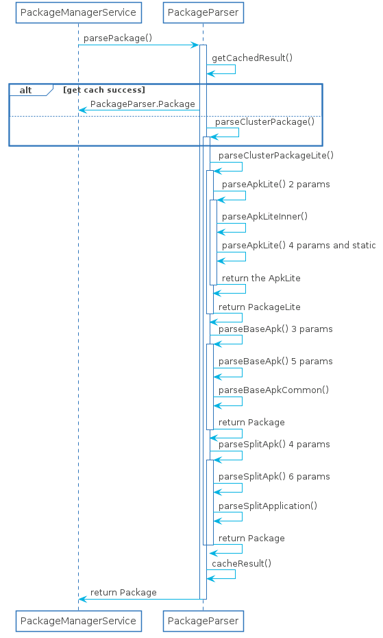
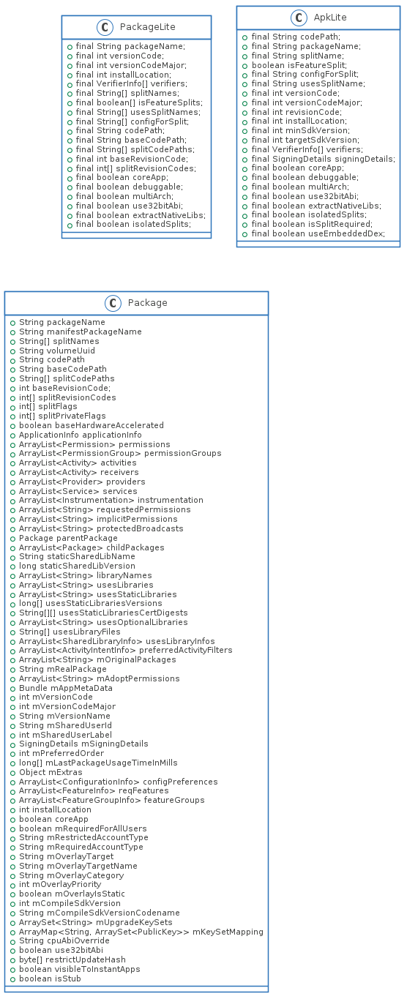

无论是通过什么方式安装的Package,parsePackage这步是少不了的。
parsePackage主要的目的是通过解析Apk中AndroidManifest.xml获取Apk的信息，最终生成Package类

# 时序图


# 类图


# ParseFlag
ParseFlag主要用于解析AndroidManifest.xml中的信息需要的标志，具体如下：
```java
PARSE_CHATTY,//临时apk
PARSE_COLLECT_CERTIFICATES,//收集签名
PARSE_ENFORCE_CODE,//必须有java代码
PARSE_EXTERNAL_STORAGE,//在sd卡外部存储中
PARSE_IGNORE_PROCESSES,//指定process name时使用
PARSE_IS_SYSTEM_DIR,//系统apk
PARSE_MUST_BE_APK,//必须是.apk文件
```
# parsePackage() 3 parms
`parsePackage()`是解析的入口，分为两种方式解析，`parseClusterPackage()`是用于Android
5.0以上版本的解析，而`parseMonolithicPackage()`用于5.0以下的版本，`parseClusterPackage()`是针对于split apk出现的.
```java
public Package parsePackage(File packageFile, int flags, boolean useCaches)
        throws PackageParserException {
    Package parsed = useCaches ? getCachedResult(packageFile, flags) : null;
    if (parsed != null) {
        return parsed;
    }

    long parseTime = LOG_PARSE_TIMINGS ? SystemClock.uptimeMillis() : 0;
    if (packageFile.isDirectory()) {
        parsed = parseClusterPackage(packageFile, flags);
    } else {
        parsed = parseMonolithicPackage(packageFile, flags);
    }

    long cacheTime = LOG_PARSE_TIMINGS ? SystemClock.uptimeMillis() : 0;
    cacheResult(packageFile, flags, parsed);
    if (LOG_PARSE_TIMINGS) {
        parseTime = cacheTime - parseTime;
        cacheTime = SystemClock.uptimeMillis() - cacheTime;
        if (parseTime + cacheTime > LOG_PARSE_TIMINGS_THRESHOLD_MS) {
            Slog.i(TAG, "Parse times for '" + packageFile + "': parse=" + parseTime
                    + "ms, update_cache=" + cacheTime + " ms");
        }
    }
    return parsed;
}
```
这里以`parseClusterPackage()`为例进行分析

## parseClusterPackage()
`parseClusterPackage()`分3步进行获取`Package`:
1. 通过`parseClusterPackageLite()`获取`PackageLite`信息
2. 通过`PackageLite`获取`AssetManager`,最后通过`parseBaseApk()`方法获取`Package`
3. 最后通过`splitName`将解析的Split apk信息插入到`Package`当中
```java
private Package parseClusterPackage(File packageDir, int flags) throws PackageParserException {
    final PackageLite lite = parseClusterPackageLite(packageDir, 0);
    if (mOnlyCoreApps && !lite.coreApp) {
        throw new PackageParserException(INSTALL_PARSE_FAILED_MANIFEST_MALFORMED,
                "Not a coreApp: " + packageDir);
    }

    // Build the split dependency tree.
    SparseArray<int[]> splitDependencies = null;
    final SplitAssetLoader assetLoader;
    if (lite.isolatedSplits && !ArrayUtils.isEmpty(lite.splitNames)) {
        try {
            splitDependencies = SplitAssetDependencyLoader.createDependenciesFromPackage(lite);
            assetLoader = new SplitAssetDependencyLoader(lite, splitDependencies, flags);
        } catch (SplitAssetDependencyLoader.IllegalDependencyException e) {
            throw new PackageParserException(INSTALL_PARSE_FAILED_BAD_MANIFEST, e.getMessage());
        }
    } else {
        assetLoader = new DefaultSplitAssetLoader(lite, flags);
    }

    try {
        final AssetManager assets = assetLoader.getBaseAssetManager();
        final File baseApk = new File(lite.baseCodePath);
        final Package pkg = parseBaseApk(baseApk, assets, flags);
        if (pkg == null) {
            throw new PackageParserException(INSTALL_PARSE_FAILED_NOT_APK,
                    "Failed to parse base APK: " + baseApk);
        }

        if (!ArrayUtils.isEmpty(lite.splitNames)) {
            final int num = lite.splitNames.length;
            pkg.splitNames = lite.splitNames;
            pkg.splitCodePaths = lite.splitCodePaths;
            pkg.splitRevisionCodes = lite.splitRevisionCodes;
            pkg.splitFlags = new int[num];
            pkg.splitPrivateFlags = new int[num];
            pkg.applicationInfo.splitNames = pkg.splitNames;
            pkg.applicationInfo.splitDependencies = splitDependencies;
            pkg.applicationInfo.splitClassLoaderNames = new String[num];

            for (int i = 0; i < num; i++) {
                final AssetManager splitAssets = assetLoader.getSplitAssetManager(i);
                parseSplitApk(pkg, i, splitAssets, flags);
            }
        }

        pkg.setCodePath(packageDir.getCanonicalPath());
        pkg.setUse32bitAbi(lite.use32bitAbi);
        return pkg;
    } catch (IOException e) {
        throw new PackageParserException(INSTALL_PARSE_FAILED_UNEXPECTED_EXCEPTION,
                "Failed to get path: " + lite.baseCodePath, e);
    } finally {
        IoUtils.closeQuietly(assetLoader);
    }
}
```
解析两次`AndroidManifest`的原因，个人猜测应该是为了区分baseApk和splitApk，
但又有点奇怪的是为什么不新增一个splitApk目录呢?baseApk扫一次，然后splitApk目录再扫描一次不就可以了
### parseClusterPackageLite()
`parseClusterPackageLite()` 会对文件夹内所有的apk进行扫描，包括baseApk和splitApk，将扫描结果`ApkLite`构造为`PackageLite`返回
```java
static PackageLite parseClusterPackageLite(File packageDir, int flags)
    throws PackageParserException {
    /*......省略部分检测代码......*/
        final ArrayMap<String, ApkLite> apks = new ArrayMap<>();
        for (File file : files) {
            if (isApkFile(file)) {
                final ApkLite lite = parseApkLite(file, flags);

                // Assert that all package names and version codes are
                // consistent with the first one we encounter.
                if (packageName == null) {
                    packageName = lite.packageName;
                    versionCode = lite.versionCode;
                } else {
                    if (!packageName.equals(lite.packageName)) {
                        throw new PackageParserException(INSTALL_PARSE_FAILED_BAD_MANIFEST,
                                "Inconsistent package " + lite.packageName + " in " + file
                                + "; expected " + packageName);
                    }
                    if (versionCode != lite.versionCode) {
                        throw new PackageParserException(INSTALL_PARSE_FAILED_BAD_MANIFEST,
                                "Inconsistent version " + lite.versionCode + " in " + file
                                + "; expected " + versionCode);
                    }
                }

                // Assert that each split is defined only once
                //注意点1
                if (apks.put(lite.splitName, lite) != null) {
                    throw new PackageParserException(INSTALL_PARSE_FAILED_BAD_MANIFEST,
                            "Split name " + lite.splitName
                            + " defined more than once; most recent was " + file);
                }
            }
        }
        Trace.traceEnd(TRACE_TAG_PACKAGE_MANAGER);

        final ApkLite baseApk = apks.remove(null);
        if (baseApk == null) {
            throw new PackageParserException(INSTALL_PARSE_FAILED_BAD_MANIFEST,
                    "Missing base APK in " + packageDir);
        }
    /*......省略部分SplitApk解析的代码......*/
    //split相关的参数都是由splitApk中的ApkLite获取
    return new PackageLite(codePath, baseApk, splitNames, isFeatureSplits, usesSplitNames,
        configForSplits, splitCodePaths, splitRevisionCodes);
    }
```
这个方法有3个值得注意的地方
1. `apks.put(lite.splitName, lite) != null`这个判断是默认每个splitName只能是唯一的，如果有相同的splitName则会解析失败
2. `final ApkLite baseApk = apks.remove(null)`baseApk的splitName是null,apks中放置的是split apk， 所以需要单独存储
3. 根据代码来看，apk的文件夹是不支持嵌套继续增加Apk的

#### parseApkLite() 2 params
```java
public static ApkLite parseApkLite(File apkFile, int flags)
        throws PackageParserException {
    return parseApkLiteInner(apkFile, null, null, flags);
}
```
#### parseApkLiteInner()
这个方法是解析单个APK的`AndroidManifest`.ApkLite是存储单个APK的信息，PackageLite包含了base和split apk的信息
```java
private static ApkLite parseApkLiteInner(File apkFile, FileDescriptor fd, String debugPathName,
        int flags) throws PackageParserException {
    final String apkPath = fd != null ? debugPathName : apkFile.getAbsolutePath();

    XmlResourceParser parser = null;
    ApkAssets apkAssets = null;
    try {
        try {
            apkAssets = fd != null
                    ? ApkAssets.loadFromFd(fd, debugPathName, false, false)
                    : ApkAssets.loadFromPath(apkPath);
        } catch (IOException e) {
            throw new PackageParserException(INSTALL_PARSE_FAILED_NOT_APK,
                    "Failed to parse " + apkPath);
        }

        parser = apkAssets.openXml(ANDROID_MANIFEST_FILENAME);

        /*......省略收集签名代码......*/

        final AttributeSet attrs = parser;
        return parseApkLite(apkPath, parser, attrs, signingDetails);

    } catch (XmlPullParserException | IOException | RuntimeException e) {
        Slog.w(TAG, "Failed to parse " + apkPath, e);
        throw new PackageParserException(INSTALL_PARSE_FAILED_UNEXPECTED_EXCEPTION,
                "Failed to parse " + apkPath, e);
    } finally {
        IoUtils.closeQuietly(parser);
        if (apkAssets != null) {
            try {
                apkAssets.close();
            } catch (Throwable ignored) {
            }
        }
        // TODO(b/72056911): Implement AutoCloseable on ApkAssets.
    }
}
```
使用`ApkAssets`打开`AndroidManifest.xml`进行解析，这里忽略了Apk签名收集

#### parseApkLite() 4 params
```java
    private static ApkLite parseApkLite(String codePath, XmlPullParser parser, AttributeSet attrs,
            SigningDetails signingDetails)
            throws IOException, XmlPullParserException, PackageParserException {
        final Pair<String, String> packageSplit = parsePackageSplitNames(parser, attrs);

        int installLocation = PARSE_DEFAULT_INSTALL_LOCATION;
        int versionCode = 0;
        int versionCodeMajor = 0;
        int targetSdkVersion = DEFAULT_TARGET_SDK_VERSION;
        int minSdkVersion = DEFAULT_MIN_SDK_VERSION;
        int revisionCode = 0;
        boolean coreApp = false;
        boolean debuggable = false;
        boolean multiArch = false;
        boolean use32bitAbi = false;
        boolean extractNativeLibs = true;
        boolean isolatedSplits = false;
        boolean isFeatureSplit = false;
        boolean isSplitRequired = false;
        boolean useEmbeddedDex = false;
        String configForSplit = null;
        String usesSplitName = null;

        /******省略解析Manifest代码******/
        return new ApkLite(codePath, packageSplit.first, packageSplit.second, isFeatureSplit,
                configForSplit, usesSplitName, isSplitRequired, versionCode, versionCodeMajor,
                revisionCode, installLocation, verifiers, signingDetails, coreApp, debuggable,
                multiArch, use32bitAbi, useEmbeddedDex, extractNativeLibs, isolatedSplits,
                minSdkVersion, targetSdkVersion);
    }
```
虽然代码看起来很长，但逻辑部分如下
1. 解析splitName
2. 定义默认的属性值
3. 解析AndroidManifest.xml中部分属性值
4. 生成`ApkLite`
其实也就第一行获取`splitName`最为重要，获取到base和split的`ApkLite`之后将其包装成`PackageLite`，进行第二次的解析

### parseBaseApk() 3 params
```java
private Package parseBaseApk(File apkFile, AssetManager assets, int flags)
        throws PackageParserException {
    final String apkPath = apkFile.getAbsolutePath();

    /*......去除部分代码...*/

    XmlResourceParser parser = null;
    try {
        final int cookie = assets.findCookieForPath(apkPath);
        if (cookie == 0) {
            throw new PackageParserException(INSTALL_PARSE_FAILED_BAD_MANIFEST,
                    "Failed adding asset path: " + apkPath);
        }
        parser = assets.openXmlResourceParser(cookie, ANDROID_MANIFEST_FILENAME);
        final Resources res = new Resources(assets, mMetrics, null);

        final String[] outError = new String[1];
        final Package pkg = parseBaseApk(apkPath, res, parser, flags, outError);
        if (pkg == null) {
            throw new PackageParserException(mParseError,
                    apkPath + " (at " + parser.getPositionDescription() + "): " + outError[0]);
        }

        pkg.setVolumeUuid(volumeUuid);
        pkg.setApplicationVolumeUuid(volumeUuid);
        pkg.setBaseCodePath(apkPath);
        pkg.setSigningDetails(SigningDetails.UNKNOWN);

        return pkg;

    } catch (PackageParserException e) {
        throw e;
    } catch (Exception e) {
        throw new PackageParserException(INSTALL_PARSE_FAILED_UNEXPECTED_EXCEPTION,
                "Failed to read manifest from " + apkPath, e);
    } finally {
        IoUtils.closeQuietly(parser);
    }
}
```
这部分的代码逻辑比较简单，构建了三个新参数`res, parser, outError`

### parseBaseApk() 5 params

```java
    private Package parseBaseApk(String apkPath, Resources res, XmlResourceParser parser, int flags,
            String[] outError) throws XmlPullParserException, IOException {
        final String splitName;
        final String pkgName;

        //1.
        try {
            Pair<String, String> packageSplit = parsePackageSplitNames(parser, parser);
            pkgName = packageSplit.first;
            splitName = packageSplit.second;

            if (!TextUtils.isEmpty(splitName)) {
                outError[0] = "Expected base APK, but found split " + splitName;
                mParseError = PackageManager.INSTALL_PARSE_FAILED_BAD_PACKAGE_NAME;
                return null;
            }
        } catch (PackageParserException e) {
            mParseError = PackageManager.INSTALL_PARSE_FAILED_BAD_PACKAGE_NAME;
            return null;
        }

        //2.
        if (mCallback != null) {
            String[] overlayPaths = mCallback.getOverlayPaths(pkgName, apkPath);
            if (overlayPaths != null && overlayPaths.length > 0) {
                for (String overlayPath : overlayPaths) {
                    res.getAssets().addOverlayPath(overlayPath);
                }
            }
        }

        final Package pkg = new Package(pkgName);

        //3.
        TypedArray sa = res.obtainAttributes(parser,
                com.android.internal.R.styleable.AndroidManifest);
        /*......省去解析xml的代码......*/
        return parseBaseApkCommon(pkg, null, res, parser, flags, outError);
    }
```
这里分为三步进行处理
1. 这个解析base apk，如果是split apk，则解析失败
2. `Callback`应该是用于RRO机制的，还未弄清楚
3. 最后解析`AndroidManifest`的`manifest`标签

### parseBaseApkCommon() 
这个方法代码太多就不放了，大致就是解析对应的标签然后设置Package属性.

### parseSplitApk() 4 params
parseSplitApk() 4 params
parseSplitApk() 6 params
parseSplitApplication()
这几个方法和base apk的解析非常的类似，就是向package中添加一些标签信息

# 总结
综上就是解析APK的全过程，基本流程如下：
1. 第一次解析目录下所有APK的`AndroidManifest.xml`获取`ApkLite`和`PackageLite`,并区分出base apk和split apk
2. 第二次分别解析base和split apk `AndroidManifest.xml`组合成一个`Package`
疑问点:
1. 为什么要解析两次，感觉可以通过将split apk放置在子目录中来区分，解析两次感觉性能降低很多
2. Callback的overlay机制还是没弄清楚。
关于Split apk的机制可以看看这篇文章[Google原生Split APK浅析](https://blog.csdn.net/ximsfei/article/details/50884862)


