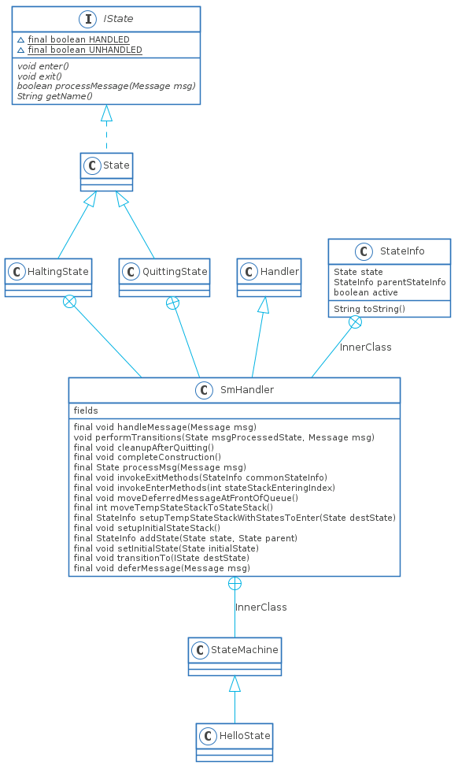

>前言:Android状态机模式在frameworks层用的还是比较广泛的,主要的是Wifi,Bluetooth,Network这几块用的比较多, 本文基于我自己改造的官方Demo,详情可参照[HelloState](https://github.com/TeenagerPeng/HelloState). 阅读本文需要的知识: Android的Handler使用, Java基础, 数据结构基础

# StateMachine类结构


# StateMachine初始化
## 时序图
如图所示,是StateMachine初始化的时序图

## StateMachine创建
StateMachine的构造方法是`protected`的访问权限,所以一般要有一个子类去继承自它.
```Java
//MainActivity.java
HelloState helloState = new HelloState("Hello State");
//HelloState.java
public HelloState(String name) {
    super(name);
    log("ctor E");

    // Add states, use indentation to show hierarchy
    addState(mP1);
    addState(mS1, mP1);
    addState(mS2, mP1);
    addState(mP2);
    //addState(mS1, mP2);
    addState(mS3, mP3);

    // Set the initial state
    setInitialState(mS1);
    log("ctor X");
}
//StateMachine.java
protected StateMachine(String name) {
    mSmThread = new HandlerThread(name);
    mSmThread.start();
    Looper looper = mSmThread.getLooper();
    //创建SmHandler
    initStateMachine(name, looper);
}
private void initStateMachine(String name, Looper looper) {
    mName = name;
    mSmHandler = new SmHandler(looper, this);
}
```
当然StateMachine也提供了让调用者自行设置Looper的构造方法,这里不再详细讨论.
创建SmHandler之后就需要添加状态,这里设计了4种状态.
```Java
//StateMachine.java
protected final void addState(State state) {
    mSmHandler.addState(state, null);
}
protected final void addState(State state, State parent) {
    mSmHandler.addState(state, parent);
}
//StateMachine$SmHandler
private final StateInfo addState(State state, State parent) {
    if (mDbg) {
        mSm.log("addStateInternal: E state=" + state.getName() + ",parent="
                + ((parent == null) ? "" : parent.getName()));
    }
    StateInfo parentStateInfo = null;
    if (parent != null) {
        //mStateInfo是HashMap<State, StateInfo>类型
        parentStateInfo = mStateInfo.get(parent);
        //1. 如果parentState不为空且没有添加到mStateInfo里面,则设置parentState为root节点
        if (parentStateInfo == null) {
            // Recursively add our parent as it's not been added yet.
            parentStateInfo = addState(parent, null);
        }
    }
    StateInfo stateInfo = mStateInfo.get(state);
    if (stateInfo == null) {
        stateInfo = new StateInfo();
        mStateInfo.put(state, stateInfo);
    }

    // Validate that we aren't adding the same state in two different hierarchies.
    //2. 是否添加了两个不同树结构下的State
    if ((stateInfo.parentStateInfo != null)
            && (stateInfo.parentStateInfo != parentStateInfo)) {
        throw new RuntimeException("state already added");
    }
    //3. 初始化StateInfo
    stateInfo.state = state;
    stateInfo.parentStateInfo = parentStateInfo;
    stateInfo.active = false;
    if (mDbg) mSm.log("addStateInternal: X stateInfo: " + stateInfo);
    return stateInfo;
}
```
StateMachine采用了一种树状的层次结构,但是可以有多个root节点,如注释1阐述了两种添加root节点的方式.
一种是`addState(mP1)`这种方式直接添加mP1作为root节点;另一种是`addState(mS3, mP3)`方式可以添加新的root节点mP3.
注释2是不能在不同root节点添加相同的State,这就造成了我一个疑惑,那为何要在注释3中初始化StateInfo呢?似乎直接在`stateInfo = new StateInfo()`下面初始化应该更好,也更加直观
最后是设置初始状态`setInitialState(mS1);`。
```Java
//StateMachine.java
protected final void setInitialState(State initialState) {
    mSmHandler.setInitialState(initialState);
}
//StateMachine$SmHandler
private final void setInitialState(State initialState) {
    if (mDbg) mSm.log("setInitialState: initialState=" + initialState.getName());
    mInitialState = initialState;
}
```
这段代码就没啥好分析的,记住`mInitialState`就可以了,启动状态机的时候会用到。最后的结构如图所示


## 启动StateMachine
启动StateMachine相当于设置初始化的状态,然后等待消息的发送
```Java
//MainActivity.java
helloState.start();

//StateMachine.java
public void start() {
    // mSmHandler can be null if the state machine has quit.
    SmHandler smh = mSmHandler;
    if (smh == null) return;
    /** Send the complete construction message */
    smh.completeConstruction();
}
//StateMachine$SmHandler
private final void completeConstruction() {
    if (mDbg) mSm.log("completeConstruction: E");

    /**
     * Determine the maximum depth of the state hierarchy
     * so we can allocate the state stacks.
     */
    int maxDepth = 0;
    //1. 对每个结点进行遍历，找出树状结构的深度
    for (StateInfo si : mStateInfo.values()) {
        int depth = 0;
        for (StateInfo i = si; i != null; depth++) {
            i = i.parentStateInfo;
        }
        if (maxDepth < depth) {
            maxDepth = depth;
        }
    }
    if (mDbg) mSm.log("completeConstruction: maxDepth=" + maxDepth);

    //2. 用于存储InitialState到root结点的数组，类似栈的结构
    mStateStack = new StateInfo[maxDepth];
    //暂时存放的数组
    mTempStateStack = new StateInfo[maxDepth];
    //3. 建立栈结构
    setupInitialStateStack();

    /** Sending SM_INIT_CMD message to invoke enter methods asynchronously */
    //发送初始化的消息，稍后再进行讨论
    sendMessageAtFrontOfQueue(obtainMessage(SM_INIT_CMD, mSmHandlerObj));

    if (mDbg) mSm.log("completeConstruction: X");
}
private final void setupInitialStateStack() {
    if (mDbg) {
        mSm.log("setupInitialStateStack: E mInitialState=" + mInitialState.getName());
    }

    StateInfo curStateInfo = mStateInfo.get(mInitialState);
    //5. 将初始结点到root结点依次放入mTempStateStack中
    //其中mTempStateStack[0] == mInitialState
    //完成后mTemStateStackCount相当于mTempStateStack.length
    for (mTempStateStackCount = 0; curStateInfo != null; mTempStateStackCount++) {
        mTempStateStack[mTempStateStackCount] = curStateInfo;
        curStateInfo = curStateInfo.parentStateInfo;
    }

    // Empty the StateStack
    mStateStackTopIndex = -1;
    //6. 反转栈结构
    moveTempStateStackToStateStack();
}
private final int moveTempStateStackToStateStack() {
    //startingIndex = 0;
    int startingIndex = mStateStackTopIndex + 1;
    //此时mTempStateStackCount - 1即相当于mTempStateStack.length - 1
    int i = mTempStateStackCount - 1;
    int j = startingIndex;
    //6. 反转栈结构
    //完成之后mStateStack[0] == root节点
    while (i >= 0) {
        if (mDbg) mSm.log("moveTempStackToStateStack: i=" + i + ",j=" + j);
        mStateStack[j] = mTempStateStack[i];
        j += 1;
        i -= 1;
    }
    
    //mStateStackTopIndex指向的是mInitialState
    mStateStackTopIndex = j - 1;
    if (mDbg) {
        mSm.log("moveTempStackToStateStack: X mStateStackTop=" + mStateStackTopIndex
                + ",startingIndex=" + startingIndex + ",Top="
                + mStateStack[mStateStackTopIndex].state.getName());
    }
    //此时这个返回没有意义，在状态切换的时候这个返回值才有意义，后续讨论
    return startingIndex;
}
```
可以看出状态机在启动的时候建立一个栈的数据结构，并且顶端"指针"`mStateStackTopIndex`是指向初始状态的。后面处理消息和处理状态切换的时候都需要用到这个栈。
接下来讨论以下`sendMessageAtFrontOfQueue(obtainMessage(SM_INIT_CMD, mSmHandlerObj));`。sendMessageAtFrontOfQueue是Handler的方法，和sendMessage差不多
```Java
//StateMachine$SmHandler
@Override
public final void handleMessage(Message msg) {
    //mHasQuit默认是false
    if (!mHasQuit) {
        //初始化的时候条件不成立
        if (mSm != null && msg.what != SM_INIT_CMD && msg.what != SM_QUIT_CMD) {
            mSm.onPreHandleMessage(msg);
        }

        if (mDbg) mSm.log("handleMessage: E msg.what=" + msg.what);

        /** Save the current message */
        mMsg = msg;

        /** State that processed the message */
        State msgProcessedState = null;
        //mIsConstructionCompleted默认是false
        if (mIsConstructionCompleted) {
            /** Normal path */
            msgProcessedState = processMsg(msg);
        } else if (!mIsConstructionCompleted && (mMsg.what == SM_INIT_CMD)
                && (mMsg.obj == mSmHandlerObj)) {
            //1. 初始化的时候执行
            /** Initial one time path. */
            mIsConstructionCompleted = true;
            //2. 从root节点开始依次调用State的enter方法，并设置activate为true
            invokeEnterMethods(0);
        } else {
            throw new RuntimeException("StateMachine.handleMessage: "
                    + "The start method not called, received msg: " + msg);
        }
        //这里是处理状态切换的，暂时不用管
        performTransitions(msgProcessedState, msg);

        // We need to check if mSm == null here as we could be quitting.
        if (mDbg && mSm != null) mSm.log("handleMessage: X");

        if (mSm != null && msg.what != SM_INIT_CMD && msg.what != SM_QUIT_CMD) {
            mSm.onPostHandleMessage(msg);
        }
    }
}
private final void invokeEnterMethods(int stateStackEnteringIndex) {
    for (int i = stateStackEnteringIndex; i <= mStateStackTopIndex; i++) {
        if (mDbg) mSm.log("invokeEnterMethods: " + mStateStack[i].state.getName());
        mStateStack[i].state.enter();
        mStateStack[i].active = true;
    }
}
```
综上所述，启动状态机有两个步骤。
1. 构建栈结构
2. 从root节点到Init节点依次调用节点State的enter()方法
下篇[Android状态机模式解析(二)](http://www.godteen.com/posts/735aa624/)
